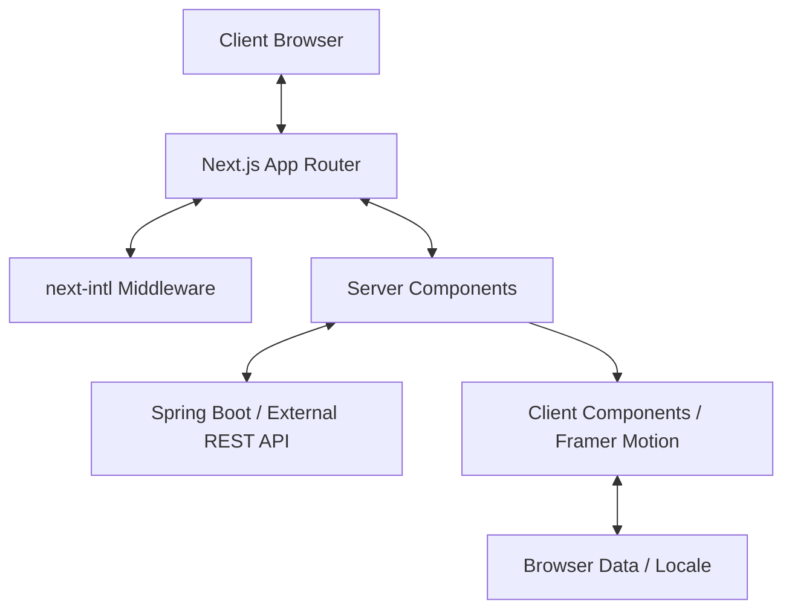

# Project Architecture

This document describes the high-level architecture and data flow of the portfolio application.

## High-Level Architecture

The application is built on **Next.js 16 (App Router)** with a focus on performance, accessibility (A11y), and multi-language support (i18n).



## Core Modules

### 1. Internationalization (i18n)

Using `next-intl`, the app uses a `[lang]` dynamic route segment.

- **Files**: `i18n/en.json`, `i18n/es.json`
- **Logic**: Middleware detects the user's preferred language or defaults to English, then provides messages via `NextIntlClientProvider`.

### 2. Layout & UI

The design system is implemented with **Tailwind CSS v4** and **Framer Motion**.

- **SitePanel**: A wrapper that manages the main content layout and animations.
- **NavPill**: A floating navigation component that tracks scroll depth and active sections.
- **ScrollProgress**: A visual indicator at the top of the viewport.

### 3. Data Flow

- **Fetching**: Server Components fetch data from the `API_BASE_URL` defined in the environment.
- **Type Safety**: All API responses are validated against TypeScript interfaces in `types/types.ts`.
- **Error Handling**: Custom error boundaries (`error.tsx`) and 404 handlers (`not-found.tsx`) are localized per language segment.

## Directory Roles

| Folder             | Responsibility                                                        |
| :----------------- | :-------------------------------------------------------------------- |
| `app/[lang]`       | Core page logic and localized layout                                  |
| `app/(components)` | Reusable UI and sectional building blocks                             |
| `data`             | API client implementation (`dataApi.ts`)                              |
| `lib`              | Utility functions (scroll logic, class merging, status color mappers) |
| `i18n`             | JSON dictionaries and request configuration                           |

## SEO & Accessibility

- **JSON-LD**: Structured data injected in the root layout to improve search engine indexing.
- **Metadata**: Dynamic metadata generation handles localized titles and descriptions.
- **A11y**: Follows WCAG guidelines with semantic HTML, ARIA labels, and a visible "Skip to Content" link.

## Project Structure

```
portfolio/
  app/
    (components)/
      layout/
        Footer.tsx
        Section.tsx
        SitePanel.tsx
      sections/
        aboutSection/
        contactSection/
        heroSection/
        projectsSection/
        technologiesSection/
      ui/
        Button.tsx
        CtaButton.tsx
        FeaturedProjectCard.tsx
        Modal.tsx
        NavPill.tsx
        ScrollProgress.tsx
    [lang]/
      layout.tsx      ← sets <html lang>, loads i18n messages, JSON-LD
      page.tsx
      error.tsx
      not-found.tsx
    globals.css
    layout.tsx        ← root metadata (Open Graph, Twitter, robots)
    page.tsx          ← redirects / → /en
  config/
    env.ts
  data/
    dataApi.ts
  i18n/
    en.json
    es.json
    request.ts
  lib/
    className.ts
    difficultyClass.ts
    errors.ts
    knowledgeLevelClass.ts
    scroll.ts
    statusClass.ts
  tests/
  types/
  next.config.ts
  postcss.config.mjs
  tsconfig.json
  vitest.config.mts
```
